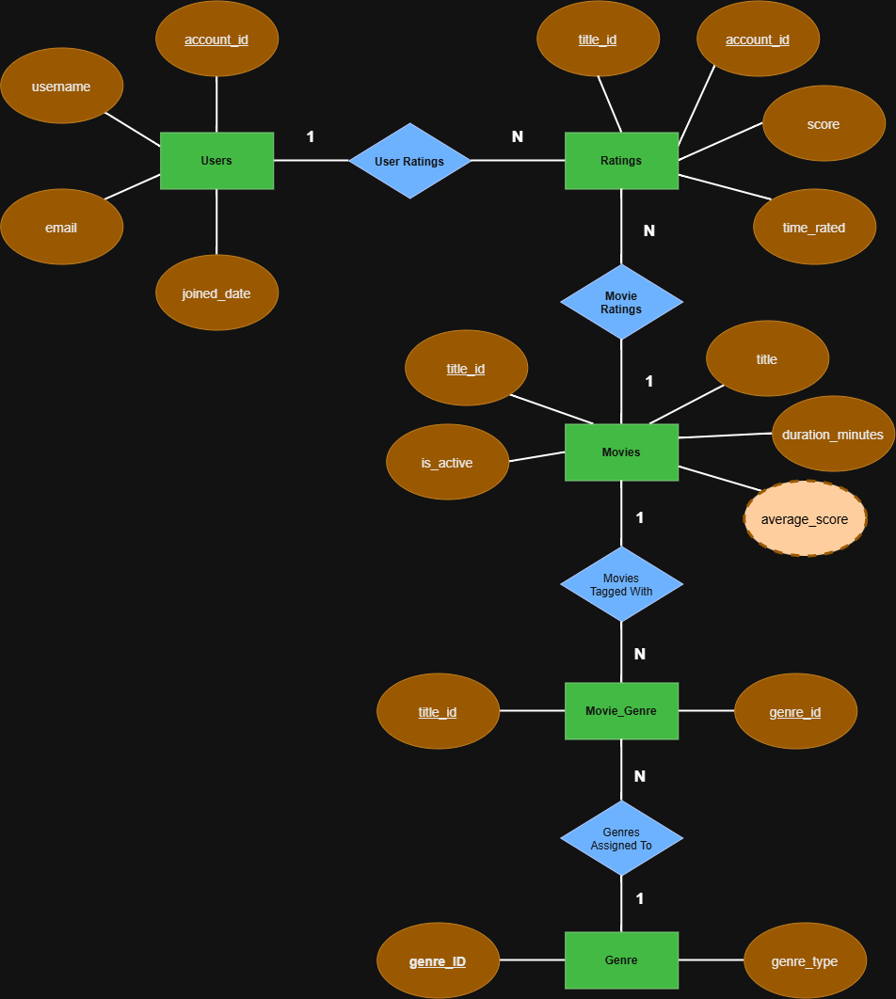

# ex603-movie-database
# Movie Ratings Platform — Relational Schema Design

A relational database design for a movie/TV rating platform, where users rate titles, browse by genre, and see aggregate scores.

**Theme:** Movies

## Domain

This platform allows registered users to rate movies titles, browse titles by genre, and see an aggregate score for each title based on all user ratings. Each title can belong to multiple genres, and each genre can apply to many titles, so the relationship between them is many-to-many. Titles can also be marked as active or delisted, allowing a title to be temporarily removed from listings without losing its rating history.

The schema must answer several core questions the platform depends on: Who rated a given title, and what score did they give it? What is a title's current average score, based only on ratings from currently active users? Which genres does a given title belong to, and which titles belong to a given genre? Can a user update a rating they've already given, or does every rating attempt create a new record? And what should happen to a title's ratings and genre tags if that title (or a user, or a genre) is ever removed from the platform?

Answering these questions shaped the key design decisions in this project: composite primary keys for the Ratings and Movie_Genre relations (since both represent relationships between two other entities rather than standalone things), an `is_active` flag on Movies to distinguish "temporarily delisted" from "permanently deleted," and a set of ON DELETE behaviors that reflect how disruptive and how frequent each kind of deletion realistically is.

## Schema

The database consists of five tables:

- **`users`** — registered accounts on the platform. Uses a surrogate primary key (`account_id`) rather than `username` or `email`, since both of those can change over time.
- **`movies`** — the movie catalog. Uses a surrogate primary key (`title_id`), since movie titles are not unique (two different movies can share a title). Includes an `is_active` flag to distinguish a movie that's temporarily delisted from one that's been permanently deleted.
- **`ratings`** — an associative entity resolving the many-to-many relationship between `users` and `movies`. Its primary key is composite (`title_id`, `account_id`), reflecting the rule that a user has at most one active rating per movie; changing a rating updates the existing row rather than inserting a new one.
- **`genre`** — the set of genre categories movies can be tagged with.
- **`movie_genre`** — a junction table resolving the many-to-many relationship between `movies` and `genre`, with a composite primary key over both foreign keys.

**Design decisions worth noticing:**

- **`average_score` is not a stored column.** It was originally modeled as a denormalized, trigger-maintained attribute on `movies`, but is now treated as a derived value, computed at query time from `ratings.score`. This avoids the risk of the stored value drifting out of sync with the underlying ratings, and follows the course's general guidance that a value which can be computed should not be duplicated in storage without a specific, measured performance reason. See `/analysis/unit2.md` for the full reasoning behind this change.
  
- **Three of four foreign keys use `ON DELETE CASCADE`**, reflecting that the dependent rows (a user's ratings, a movie's ratings, a movie's genre tags) have no independent meaning once their parent row is gone. The fourth (`movie_genre.genre_id → genre.genre_id`) uses `ON DELETE RESTRICT` instead, since deleting a genre is a rare, platform-wide action that should require explicit cleanup rather than silently untagging every associated movie. Full justification for each choice is in `/analysis/unit2.md`.
  
- Every constraint (`PRIMARY KEY`, `FOREIGN KEY`, `CHECK`, `UNIQUE`) is explicitly named using a `pk_` / `fk_` / `chk_` / `uq_` prefix convention, so that constraint violations produce readable error messages.

## Entity Relationship Diagram

## Repository Structure

- `/schema/erd.png` — Exported ERD (Task 1.2)
- `/schema/schema-definition.md` — Relation schemas, attributes, domains, and primary keys (Task 1.1)
- `/schema/constraints.md` — Integrity constraints and ON DELETE justifications (Task 1.3)
- `/analysis/unit1.md` — Modelling justification and reflection (Task 1.4)
